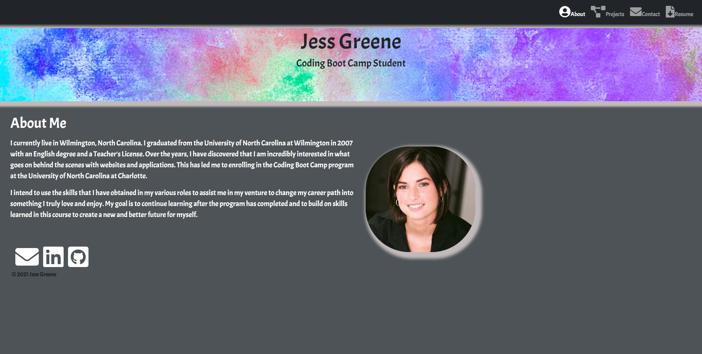
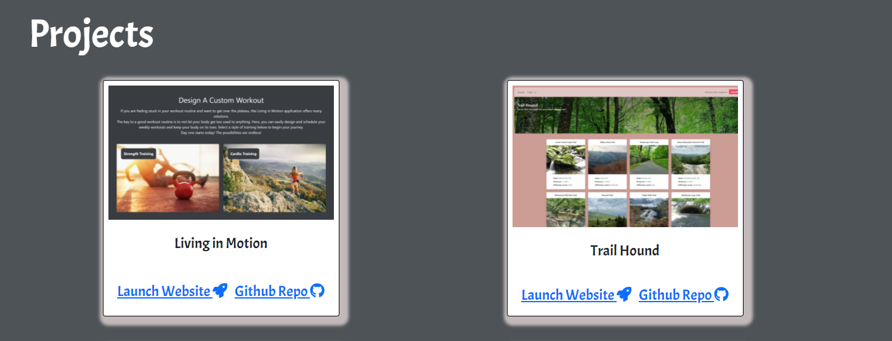
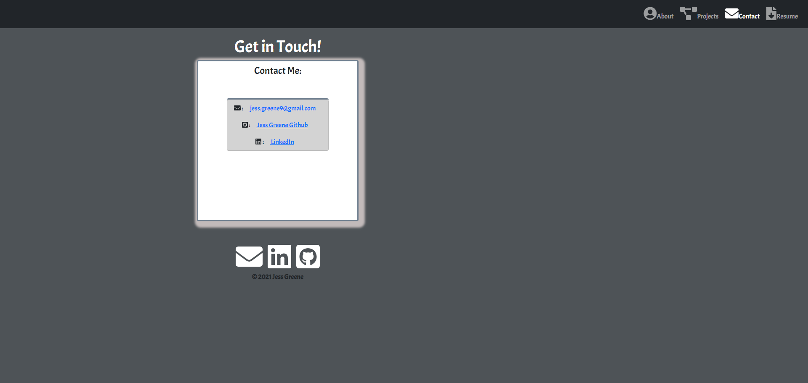

# updated-portfolio
Updated Portfolio using React

## Table of contents
- [Deployed Website](#deployedwebsite)
- [Description](#description)
- [Screenshots](#screenshots)
- [Tech/Framework](#tech/framework)
- [Contact](#contact)
- [License](#license)

## Deployed Website

https://jessgreene9.github.io/updated-portfolio/

## Description

This is a professional portfolio highlighting the skills of the web developer's background. Within the portfolio, one will find background information, projects the developer has completed, and contact information. A recent picture and the developer's name is included. 

This site allows a prospective employer to view an short bio on the homepage and the navigation bar at the top allows easy access to a projects page as well as a page with contact information. Also included in this section is an easily downloadable PDF file containing the developer's resume. 

The site includes 6 recent projects with links to both the deployed site as well as the Github repository. 

This webpage is responsive and will adjust to a smaller view-point for readability. The contact links at the bottom of the page will allow a potential employer to access the developer's Github repositories as well as be able to click the email link and automatically be brought to a new email message. A link to their LinkedIn profile is also included. 

## Screenshots

## Tech/Framework

VS Code
React
Bootstrap

## Contact

    
For any questions about this project, please visit my GitHub page: [GitHub Profile](https://github.com/jessgreene9)
      
Or email me at: [Jess Greene](mailto:jess.greene9@gmail.com)

## License

